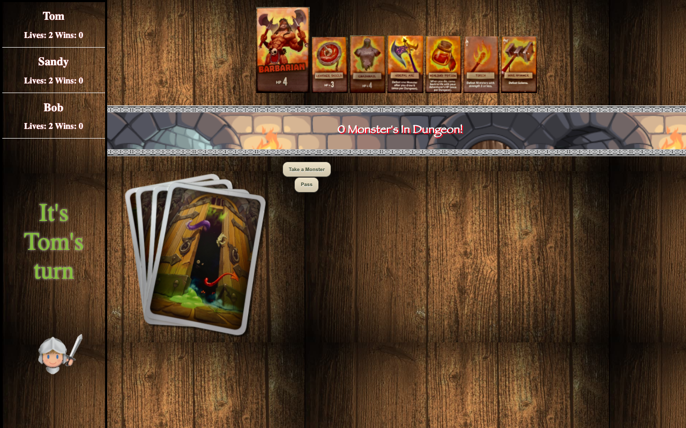
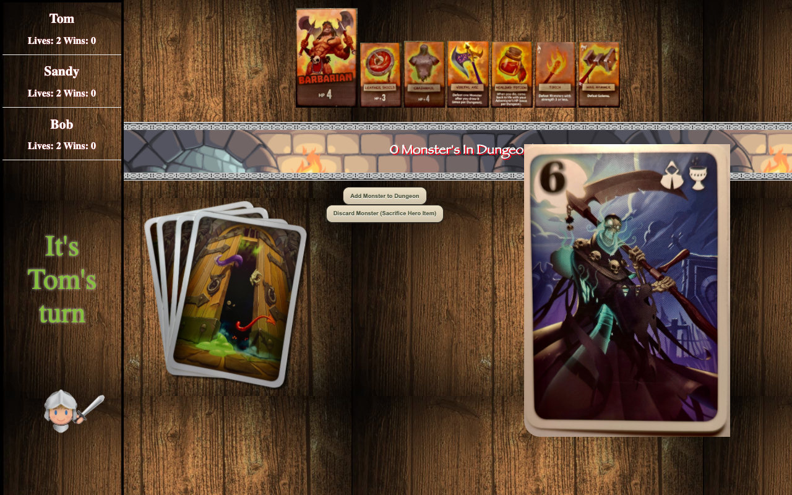
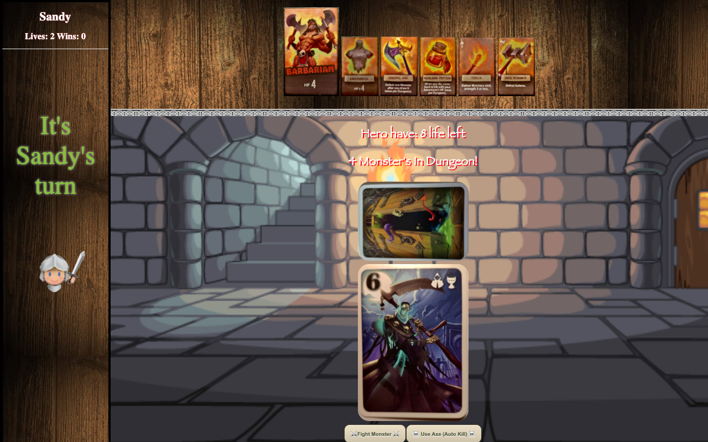
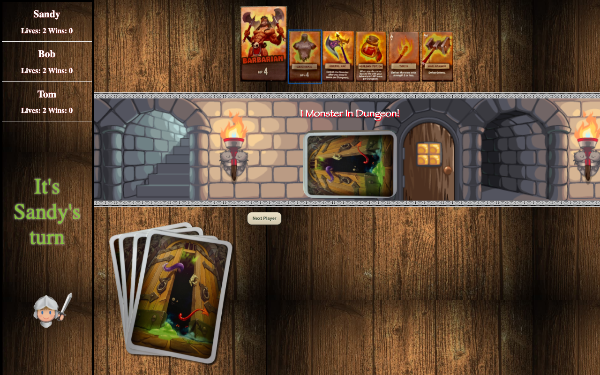

# Board Game created using JavaScript, Vue framework.

The app a digital version of board-game “Welcome to the Dungeon”. Game is design around fighting monsters in dungeon with total live and different equipment that can kill particular types of monsters. 
All pieces of the game are stored and are added to the app from mongodb database.

#### Each player will pick one card each(Monster) and presented with option of putting the monster in the dungeon or discarding it.If the player chooses to discard the monster however then the player needs to discard one of the equipment items from the hero!

### At the beginning of the player's turn however player can choose to Pass. That means they are out of this turn and they don't have to pick monster. However they won't be able to rejoin until the last player attempted to kill all monsters in the dungeon. Fight with the dungeon as happening automatically once there's the last player that did not Pass
#
#

### In this example Sandy was the last person and now needs to fight the dungeon. The first monster has a strength of 6 which means he will take 6 life from the hero. However the Vortal Axe that we have in the equipment can be used as one-time thing and kill the monster instantly (without taking any damage).
## After we will move to another Monster.

#
#
### The goal of the game is to destroy all monsters in the dungeon twice. However, if you will fail twice your out of the game as each player have only 2 lives!
